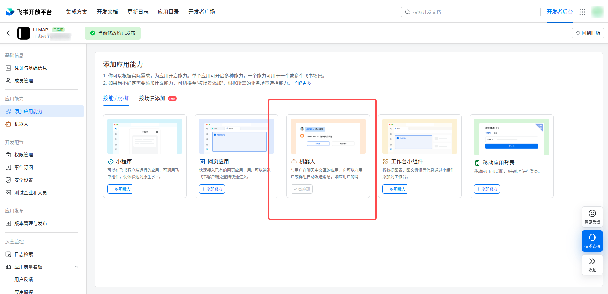
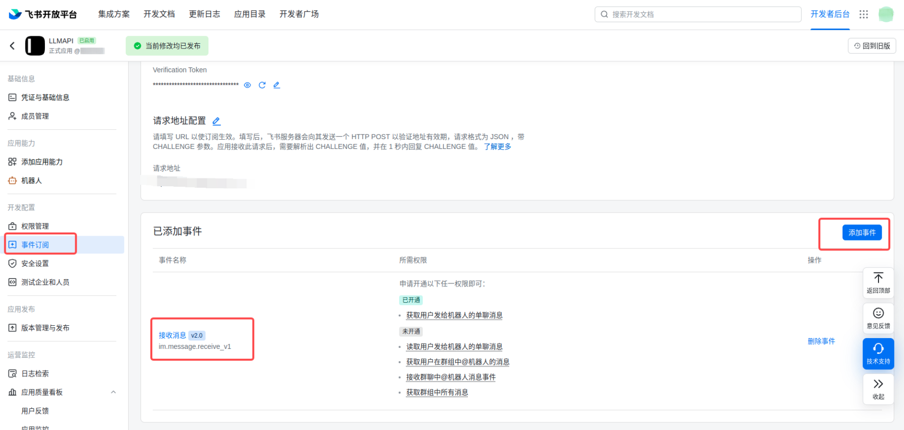
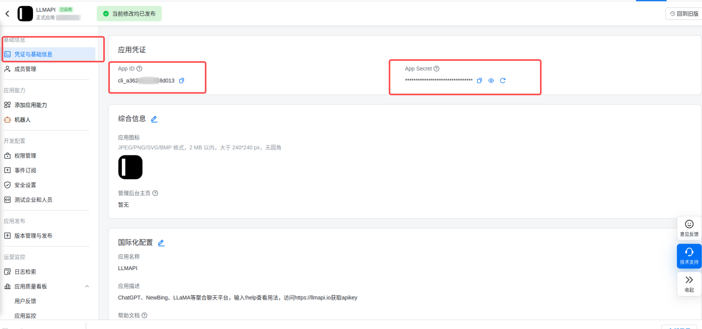
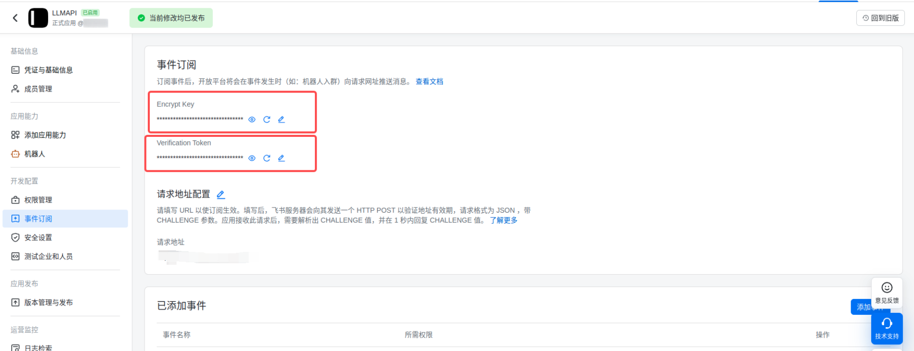
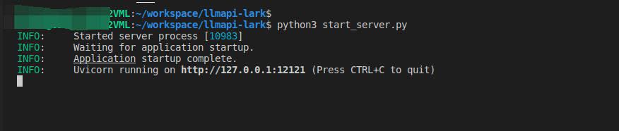
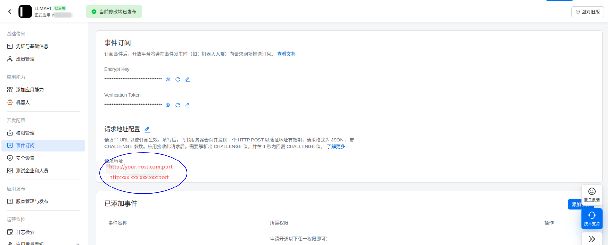
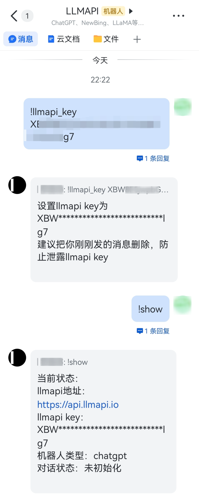

<p align="center">
  
  <h1 align="center">feishu-chatbot</h1>
  <p align="center">私有化部署飞书机器人，和ChatGPT直接聊天</p>
</p>

## 介绍(Intro)
与`ChatGPT` `GPT-3` `New-Bing`等流行的大模型聊天，与未来对话。飞书机器人已经准备好了，现在就来享受与AI技术的畅谈吧！

## 安装依赖(Deps)

```bash
# python 3.6+
pip install -r requirements.txt
```

## 配置服务(Deploy)
- 在飞书开放平台创建应用，打开```机器人```能力
<p align="center">
  
</p>

- 订阅```接收消息``` 事件，并按需开通权限
<p align="center">
  
</p>

- 复制`.env.json.example`为`.env.json`，并填写```app_id``` ```app_secret``` ```encryption_key``` ```verification_token```，这几个字段在你的应用详情页可以找到
<p align="center">
  
  
</p>

- 启动项目
```bash
python3 start_server.py
```
<p align="center">
  
</p>

- 配置```请求地址```,格式为```http://your_domain:port```
<p align="center">
  
</p>

- 如果你使用nginx作为代理，则需要将服务端口映射到本地12121端口
- 按照如下配置```start_server.py```
```python
config = uvicorn.Config("process:app", port=12121, log_level="info", host="0.0.0.0")
```
- 无论哪种方式，请注意相应的端口号不被防火墙拦截

## 在飞书上体验(Play)

- 在飞书中搜索你创建的机器人
- 给机器人发送```!help```，查看机器人支持的功能
- 按照提示使用机器人
- 如果是自建llmapi server，则配置llmapi_host为你的llmapi server地址，否则默认使用```https://api.llmapi.io```
- 如果使用默认llmapi server，可以在```https://llmapi.io```上注册账号，获取```api key```，然后在飞书中发送```!llmapi_key your_api_key```
- 使用```!show```命令查看当前配置，这在出错时可以帮助你排查问题
- 配置完成后，给机器人发消息，机器人会自动回复
<p align="center">
  
  
</p>

## 反馈(Feedback)

请在issue中反馈问题

## 致谢(Acknowledgements)
- [ChatGPT](https://chat.openai.com/)
- [Copilot](https://copilot.github.com/)
